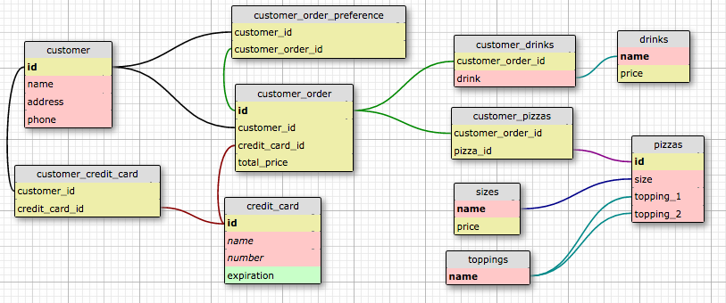

## Description

Piccadilly Pizza is a diamond in the rough: their deep dish is the bomb dot com, but they're just breaking even because they lack the easy-to-use online ordering interface that will give them a competitive edge.

Your job is to design a schema based on the guidelines Piccadilly Pizza has provided, complete with a programmatic component that allows for basic to CRUD operations on the data.

As a proof of concept, you will first create an E-R diagram that specifies the relationships between these data types, similar to [this one](http://www.conceptdraw.com/How-To-Guide/picture/erd-entity-relationship-diagram-symbols/SOFTWARE-DEVELOPMENT-ERD-Entity-Relationship-Model-Diagram.png). You can use a tool like [Draw.io](https://www.draw.io/?splash=0&libs=er;general;advanced;uml;basic;flowchart;arrows), [WWW SQL Designer](http://ondras.zarovi.cz/sql/demo/) or [MySQL Workbench](https://www.mysql.com/products/workbench/) to create this diagram ([here's](https://www.mysql.com/common/images/products/MySQL_Workbench_Visual_Design_Mac.png) an example).

Your job is also to provide a basic API that provides the ability to CRUD the data in each of these tables. [Designing a RESTful API With Node and Postgres](http://mherman.org/blog/2016/03/13/designing-a-restful-api-with-node-and-postgres/#.WAqKX5MrKRt) is a great resource for getting started - please adapt the implementation to your own needs.
## Context

This project will give you experience in designing a robust schema that represents a complex, real-world system as well as an introduction to how to update your DB without having to worry too much about complex join operations.

The suggested prerequisite knowledge for this goal: #96 + having a relative level comfort with implementing CRUD operations. 
## Specifications

Before diving in, it is **strongly recommended** to review the video and code from @tannerwelsh's remote cognitive apprenticeship session: [Relational DB schema design for a bookstore](https://github.com/GuildCrafts/cog-app/tree/master/sessions/02-bookstore-db-schema-20161026).

Piccadilly wants its system to:
- [ ] Track all of its **customers** and any relevant customer information, such as customer ID, name, username/login details, delivery address(es), phone number(s), payment methods on file (e.g., cash, credit, check - if credit, then the card number should also be stored), etc.
- [ ] Track each customer's pizza **preferences**
- [ ] Track the **ingredients** that comprise each of these preferences (e.g., onions, ham, pineapple, anchovies, bacon, etc.)
- [ ] Track standard **drinks**, including a product ID, drink description, manufacturer, supplier, price
- [ ] Support calculating the proper sales tax (the pizza joint located at the intersection of the four corners of the US, so you might have to support sales taxes for Colorado, Arizona, New Mexico and Utah)
- [ ] Track its **pizza** sizes (small, medium, large, extra large), types (thick or thin crust), **ingredients** (pepperoni, sausage, mushrooms, onions, cheese, etc.), price data for these pizza sizes and ingredients, and happy hour price discounts.

HINT: if you see an item in bold, you may want to consider creating a table for that item. :)

Please feel free to adapt the content of the data to your personal preferences or adjust your schema to support any other data types or operations you can think of. 

Also feel free to alter the spec according to what your team is realistically able to accomplish during the course of a week. 

[Get creative](https://www.youtube.com/watch?v=9C_HReR_McQ)!
### Required
- [ ] The artifact produced is properly licensed, preferably with the [MIT license](https://opensource.org/licenses/MIT).
## Quality Rubric
- The E-R diagram is fully fleshed out according to spec. 
- The E-R diagram includes whether or not each relationship in the schema is is one to one, one to many, or many to many. 
- The E-R diagram contains a list of attributes for each entity and relationship 
- The E-R diagram contains the SQL data types of each attribute in the schema
- The E-R diagram  notes any foreign or primary keys in each table in the schema
- The E-R diagram minimizes data redundancy
- There is a simple interface that allows one to CRUD the data in the specification (this interface can be as simple as a checkbox that "orders" a pizza by creating a DB record in one of your tables)
- Table names are singular, not plural
## Helpful resources

[18+ Best Online Resources for Learning SQL and Database Concepts](http://www.vertabelo.com/blog/notes-from-the-lab/18-best-online-resources-for-learning-sql-and-database)

[Designing a RESTful API With Node and Postgres](http://mherman.org/blog/2016/03/13/designing-a-restful-api-with-node-and-postgres/#.WAqKX5MrKRt)
---

<!-- LICENSE -->

 This work is licensed under a <a rel="license" href="http://creativecommons.org/licenses/by-nc-sa/4.0/">Creative Commons Attribution-NonCommercial-ShareAlike 4.0 International License</a>.
